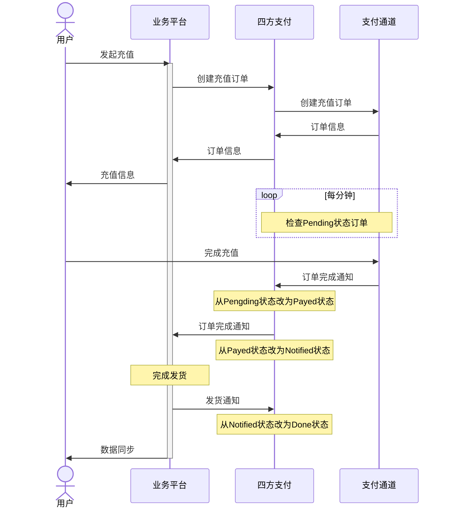
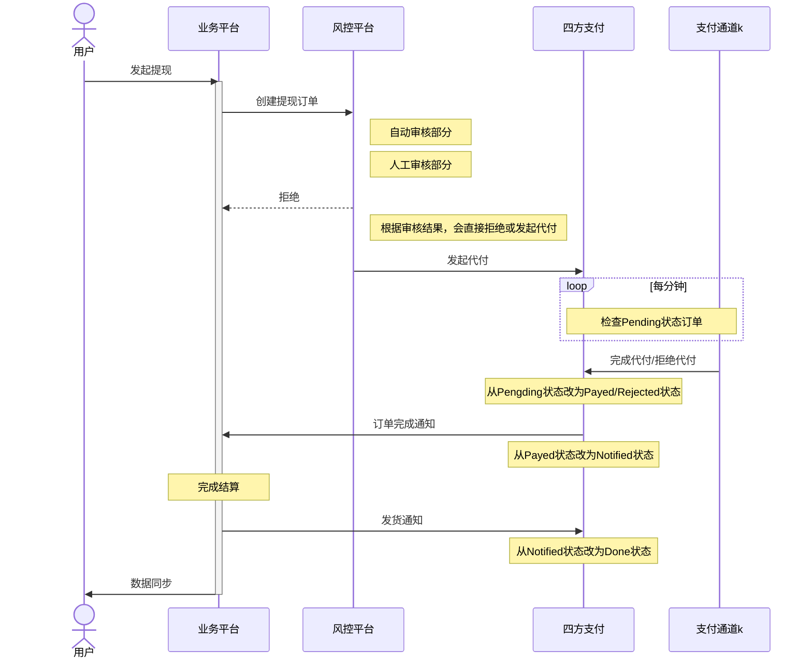

涉及到的角色：
- 业务平台：直接面向用户的产品
- 用户：业务平台的使用者
- 支付通道：提供支付服务的平台
- 四方支付：聚合多加支付通道的平台，将支付接入标准化，简化业务平台的接入工作


代收/充值流程

``` mermaid
sequenceDiagram
actor U as 用户
participant P as 业务平台
participant F as 四方支付
participant X as 支付通道

U->>P: 发起充值
activate P
P->>F: 创建充值订单
F->>X: 创建充值订单
X->>F: 订单信息
F->>P: 订单信息
P->>U: 充值信息
loop 每分钟
Note over F, X: 检查Pending状态订单
end
U->>X: 完成充值
X->>F: 订单完成通知
Note over F: 从Pengding状态改为Payed状态
F->>P: 订单完成通知
Note over F: 从Payed状态改为Notified状态
Note over P: 完成发货
P->>F: 发货通知
Note over F: 从Notified状态改为Done状态
P->>U: 数据同步
deactivate P
```

代付/提现流程

``` mermaid
sequenceDiagram
actor U as 用户
participant P as 业务平台
participant Y as 风控平台
participant F as 四方支付
participant X as 支付通道k

U->>P: 发起提现
activate P
P->>Y: 创建提现订单
Note Right of Y: 自动审核部分
Note Right of Y: 人工审核部分
Y-->>P: 拒绝
Note Right of Y: 根据审核结果，会直接拒绝或发起代付
Y->>F: 发起代付
loop 每分钟
Note over F, X: 检查Pending状态订单
end
X->>F: 完成代付/拒绝代付
Note over F: 从Pengding状态改为Payed/Rejected状态
F->>P: 订单完成通知
Note over F: 从Payed状态改为Notified状态
Note over P: 完成结算
P->>F: 发货通知
Note over F: 从Notified状态改为Done状态
P->>U: 数据同步
deactivate P
```

1. 业务平台是否还需要保存进行中的订单？
2. 对于Notified状态的订单，是否需要定时补发？

风控流程

```mermaid

```