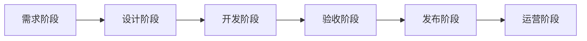
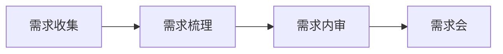
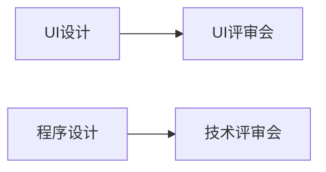
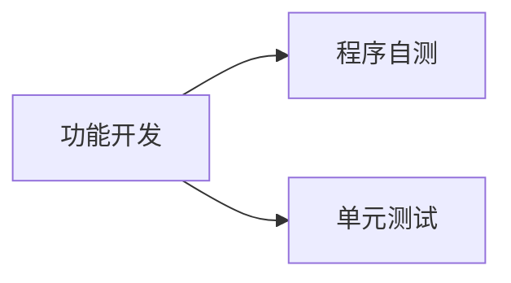
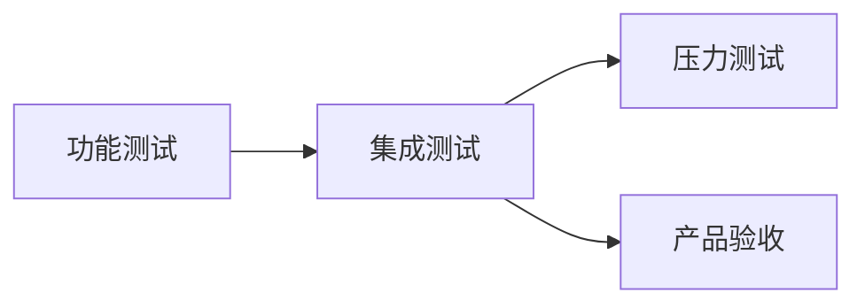

# 总流程

# 需求阶段

阶段产出：
- 产品：产品文档、交互设计
- 测试：测试用例

# 设计阶段

阶段产出：
- 产品：多语言表
- UI：UI设计稿
- 测试：测试用例
- 开发：API文档、技术文档
- 项目经理：研发排期表

# 开发阶段

阶段产出：
- 开发：程序、自测报告、部署文档

# 验收阶段

阶段产出：
- 测试：测试报告
- 开发：版本(CI自动生成)
- 运维：验收环境

参考资料：
- [版本规范]()

# 发布阶段

阶段产出：
- 测试：版本报告
- 运维：正式环境
- 开发：更新申请

# 运营阶段

阶段产出：
- 运维：运维报告
